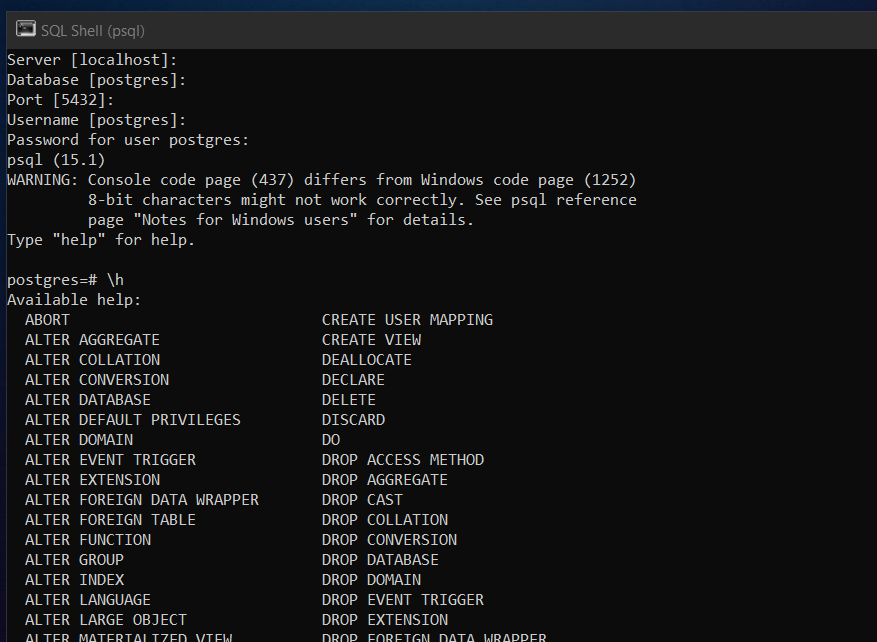

## PostgreSQL Database

PostgreSQL is a Relational Database Structured Query Language. 

💡 [About PostgreSQL](https://www.postgresql.org/about/)

## Download PostgreSQL

👉 [Link](https://www.enterprisedb.com/downloads/postgres-postgresql-downloads)

## PostgreSQL shell

📷 

## basic command

* For help ```\h```
* Check database list ```\l```
* Create Database ```CREATE DATABASE test;```


